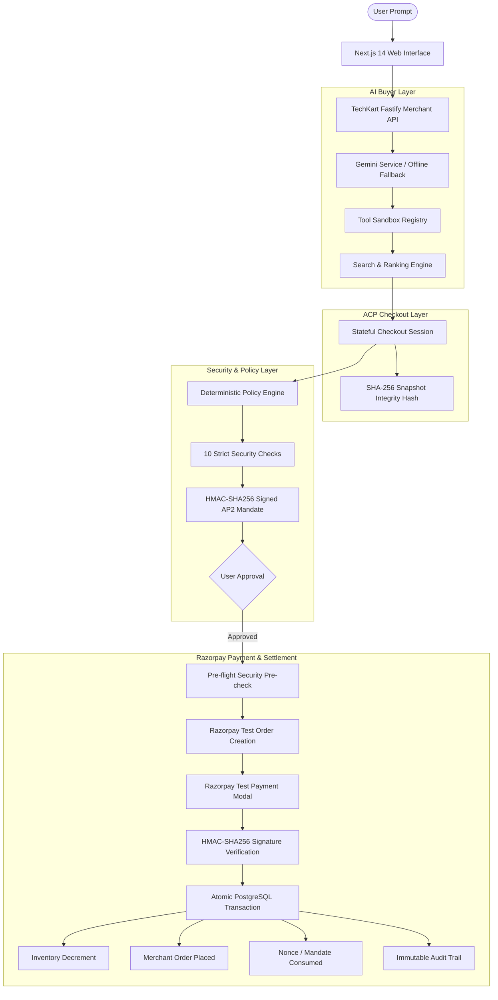

# 🛒 AgentCart — AI-Native Commerce Layer

> **Razorpay AI Buildathon Project — Track: AI Growth & Agentic Commerce**  
> An autonomous, deterministic, and secure AI-powered commerce system that makes traditional merchants **machine-readable and buyable by AI agents**.

[](https://nodejs.org/)
[](https://www.typescriptlang.org/)
[](https://fastify.dev/)
[](https://nextjs.org/)
[](https://www.postgresql.org/)
[](https://www.prisma.io/)
[](https://vitest.dev/)
[](https://razorpay.com/)

---

## 🎯 Executive Summary

Today’s e-commerce is built for humans browsing websites with point-and-click graphical interfaces. AI shopping agents, however, require a **deterministic, structured, and cryptographically verified protocol** to safely discover, negotiate, validate, and purchase goods on behalf of users.

**AgentCart** delivers this missing infrastructure:
```text
User Natural Language Intent
       ↓
Gemini AI Buyer (Extraction & Candidate Ranking)
       ↓
ACP-Compliant Merchant Checkout Session
       ↓
Deterministic Policy Engine (10 Security Checks)
       ↓
AP2 Cryptographic Authorization Mandate
       ↓
User Approval
       ↓
Razorpay Test Mode Payment Execution
       ↓
Cryptographic Server-Side Signature Verification
       ↓
Atomic Merchant Order & Stock Decrement (PostgreSQL)
       ↓
Immutable Audit Trail & Webhook Ingestion
```

### Core Architecture Principle:
> **"The LLM reasons. The backend controls money."**  
> The AI agent is completely isolated from payment secrets and cannot directly access or trigger funds transfer. Every transaction requires user authorization, strict policy validation, and server-authoritative settlement.

---

## 📌 Implementation Status (Phases 1–5 Complete)

| Phase | Milestone | Capabilities & Deliverables | Status |
|---|---|---|---|
| **Phase 1** | **Merchant Foundation (TechKart)** | PostgreSQL 18 catalog, inventory engine, real-time stock reservations, rule engine (discounts, add-ons, timeouts). | ✅ **Completed** |
| **Phase 2** | **AI Buyer Layer** | Gemini intent parser, tool sandboxing, anti-prompt injection sanitization, multi-factor ranking, cart service. | ✅ **Completed** |
| **Phase 3** | **Agentic Checkout Protocol (ACP)** | Stateful `/checkout_sessions`, line item adjustments, delivery options, SHA-256 snapshot integrity hashing. | ✅ **Completed** |
| **Phase 4** | **Security & Authorization (AP2)** | Deterministic 10-check Policy Engine, HMAC-SHA256 signed mandates, nonces, replay protection, approval modal. | ✅ **Completed** |
| **Phase 5** | **Razorpay Test Payment & Orders** | Pre-flight checks, Razorpay orders (paise units), test payment execution, HMAC signature verification, atomic order placement, webhooks. | ✅ **Completed** |

---

## 🏛️ System Architecture



---

## 🛡️ Security & Deterministic Controls (The Differentiator)

AgentCart provides enterprise-grade safety boundaries designed to prevent autonomous AI financial loss:

1. **Deterministic Policy Engine (10 Strict Checks)**:
   - **Constraints Validity**: Verifies authorization window is active.
   - **Checkout Readiness**: Enforces status `READY_FOR_PAYMENT` (prevents double payments or paying canceled carts).
   - **Currency Consistency**: Asserts exact currency match (e.g. `INR == INR`).
   - **Spending Budget Limits**: Rejects any total exceeding the user-authorized ceiling.
   - **Merchant Allowlist**: Guarantees transactions execute only with authorized merchant UUIDs.
   - **Product Category Allowlist**: Restricts purchases to pre-approved categories.
   - **Quantity Limits**: Prevents hallucinated bulk-orders.
   - **Mandatory Feature Checks**: Ensures product specs (e.g. ANC, wireless) match requirements.
   - **Real-Time Stock Verification**: Checks live PostgreSQL inventory prior to mandate generation.
   - **Checkout Snapshot Integrity**: Cryptographically validates that neither the merchant nor client tampered with prices or line items.

2. **AP2-Inspired Cryptographic Mandates**:
   - Every purchase requires a signed `AuthorizationMandate` bound to a unique single-use cryptographic nonce (`nonce_...`).
   - Signatures are verified using HMAC-SHA256 over canonicalized payload properties.
   - Replay protection guarantees that a used nonce can never initiate a second transaction.

3. **Server-Authoritative Commercial Truth**:
   - Client applications and AI models **never** specify final prices, taxes, or discounts.
   - The Fastify backend computes all totals, discounts (e.g. 5% keyboard discount, 10% premium tier), taxes (10% GST), and delivery fees.

4. **Indirect Prompt Injection Defense**:
   - Product descriptions, specifications, and untrusted reviews are strictly sanitized before reaching LLM reasoning contexts.

5. **Webhook Replay Protection**:
   - Razorpay webhook payloads are verified against `RAZORPAY_WEBHOOK_SECRET` and de-duplicated in PostgreSQL (`WebhookEvent` table).

---

## 🧰 Tech Stack

| Component | Technology | Purpose |
|---|---|---|
| **AI Intelligence** | Google Gemini API (`@google/generative-ai`) | Intent extraction, constraint parsing, multi-candidate scoring & ranking |
| **Backend Framework** | Node.js, Fastify v5, TypeScript (Strict Mode) | High-performance, schema-validated REST APIs |
| **Database & ORM** | PostgreSQL 18, Prisma ORM v6.4 | Authoritative data store for catalog, sessions, mandates, payments & orders |
| **Data Validation** | Zod v3 | Runtime boundary validation on all inputs and protocol messages |
| **Frontend Framework** | Next.js 14 (App Router), React 18, Tailwind CSS | Dual-mode UI (AI Buyer Chat & Merchant Catalog) with real-time feedback |
| **Payment Gateway** | Razorpay Test Mode (`razorpay` Node SDK & API) | Test order creation, test payment execution, and cryptographic verification |
| **Testing** | Vitest v3 | 68 automated unit, integration, and security test cases |
| **Workspace Manager** | NPM Workspaces | Monorepo orchestrating `@agentcart/api` and `@agentcart/web` |

---

## 📂 Project Structure

```text
Agentic_Commerce/
├── apps/
│   ├── api/                           # Backend API service (Port 4000)
│   │   ├── src/
│   │   │   ├── config/                # Environment variables, Prisma client
│   │   │   ├── routes/                # Fastify route controllers (catalog, cart, ACP, mandates, payments)
│   │   │   ├── schemas/               # Zod validation schemas (ACP, AP2, Razorpay, Products)
│   │   │   ├── services/              # Core business logic:
│   │   │   │   ├── ai-buyer.service.ts       # Gemini intent & ranking
│   │   │   │   ├── checkout.service.ts       # ACP state machine & totals calculation
│   │   │   │   ├── policy-engine.service.ts  # Deterministic 10-check policy validator
│   │   │   │   ├── mandate.service.ts        # AP2 signed authorization mandates
│   │   │   │   ├── payment.service.ts        # Razorpay integration & atomic settlement
│   │   │   │   ├── razorpay.provider.ts      # Razorpay client & signature generator
│   │   │   │   ├── audit.service.ts          # Structured audit logging
│   │   │   │   └── rules-engine.service.ts   # Merchant retail business rules
│   │   │   └── app.ts                 # Fastify app builder with CORS, rate-limiting & plugins
│   │   └── tests/                     # 9 Vitest test suites (68 tests)
│   │
│   └── web/                           # Frontend application (Port 3000)
│       └── src/
│           ├── app/                   # Next.js App Router root layout & page
│           ├── components/
│           │   ├── buyer/             # AI Buyer Interface, Timeline, ACP Checkout, Mandate & Payment Modals
│           │   ├── ProductCard.tsx    # Merchant catalog item card
│           │   ├── CartOptimizerModal.tsx # Simulated cart with instant ACP checkout trigger
│           │   └── Navbar.tsx         # Responsive header with cart count & drawer toggles
│           └── lib/                   # API clients, TypeScript types, utilities
│
├── prisma/
│   ├── schema.prisma                  # Complete relational schema (12 Prisma models)
│   └── seed.ts                        # Seed script generating TechKart merchant & 25 products
├── docs/                              # Comprehensive architecture & API documentation
├── .env.example                       # Documented environment variable template
└── package.json                       # Monorepo scripts & dependencies
```

---

## ⚡ Quickstart & Local Setup

### 1. Prerequisites
- **Node.js**: `v20.x` or higher (v22 recommended)
- **PostgreSQL**: Local PostgreSQL 18 or Docker running on port `5432`

### 2. Clone & Install Dependencies
```bash
git clone https://github.com/VaibhavDataSci/Agentic_Commerce.git
cd Agentic_Commerce
npm install
```

### 3. Configure Environment Variables
Create `.env` in the root directory:
```bash
cp .env.example .env
```

Ensure the following variables are defined:
```env
# PostgreSQL Database Connection
DATABASE_URL="postgresql://VAIBHAV@localhost:5432/agentcart"

# Fastify Server Configuration
PORT=4000
HOST="0.0.0.0"
NODE_ENV="development"
CORS_ORIGIN="http://localhost:3000"

# Rate Limiting
RATE_LIMIT_MAX=100
RATE_LIMIT_WINDOW_MS=60000

# Frontend API URL
NEXT_PUBLIC_API_BASE_URL="http://localhost:4000"

# Razorpay Test Mode Credentials
RAZORPAY_KEY_ID="rzp_test_YourKeyIdHere"
RAZORPAY_KEY_SECRET="YourRazorpayKeySecretHere"
RAZORPAY_WEBHOOK_SECRET="YourRazorpayWebhookSecretHere"

# Optional: Google Gemini API Key (Has deterministic fallback when omitted)
GEMINI_API_KEY="your-gemini-api-key"
```

### 4. Database Setup & Seeding
```bash
# Push schema to PostgreSQL
npm run db:push

# Seed TechKart electronics merchant & 25 catalog products
npm run db:seed
```

### 5. Start Application
```bash
# Run both Backend (:4000) and Frontend (:3000)
npm run dev

# Or start services individually:
npm run dev:api    # Fastify backend
npm run dev:web    # Next.js frontend
```

- **Frontend**: [http://localhost:3000](http://localhost:3000)  
- **Backend API**: [http://localhost:4000](http://localhost:4000)  
- **API Health Check**: [http://localhost:4000/health](http://localhost:4000/health)

---

## 🧪 Automated Testing

AgentCart maintains an extensive test suite verifying end-to-end security, policy boundaries, cryptographic signatures, and payment idempotency.

```bash
# Run complete test suite across all 9 suites
npm run test

# Run TypeScript strict typechecking
npm run typecheck
```

### Test Suite Summary:
```text
 ✓ tests/acp-checkout.test.ts (11 tests)
 ✓ tests/ai-buyer.test.ts (7 tests)
 ✓ tests/api.test.ts (6 tests)
 ✓ tests/audit.test.ts (5 tests)
 ✓ tests/authorization.test.ts (8 tests)
 ✓ tests/payment.test.ts (8 tests)
 ✓ tests/policy-engine.test.ts (10 tests)
 ✓ tests/ranking.test.ts (6 tests)
 ✓ tests/rules-engine.test.ts (7 tests)

 Test Files  9 passed (9)
      Tests  68 passed (68)
   Duration  946ms
```

---

## 🎮 Manual Walkthrough & User Flows

### Flow A: Gemini AI Natural-Language Shopping
1. Navigate to **[http://localhost:3000](http://localhost:3000)**.
2. In the **Phase 2: AI Buyer Agent** prompt box, try entering:
   > *"Find me wireless ANC headphones under ₹5,000, deliverable in 2 days"*
3. Click **Find & Rank**:
   - Gemini parses constraints (category: `headphones`, max budget: `₹5,000`, feature: `ANC`).
   - The tool sandbox queries the PostgreSQL catalog and ranks matching items by relevance, price, rating, and stock.
4. Click **Add to Cart** on a recommended item.
5. In the active cart banner, click **Proceed to Agentic Checkout**.
6. Select your delivery option (**Standard FREE** or **Express ₹200**).
7. Click **Authorize Purchase (AP2 Mandate)**:
   - The **Policy Engine** evaluates the 10 security checks.
   - An AP2 cryptographic mandate is issued with HMAC-SHA256 signature.
8. Click **Approve & Pay**:
   - The Razorpay Test Mode payment modal opens.
   - Click **Pay (Test Mode)** to execute test settlement.
   - The server verifies the signature, marks the checkout complete, decrements stock, creates the merchant order, and displays the **Order Confirmation**.

---

### Flow B: Traditional Merchant Catalog + Cart Optimizer
1. Switch to the **Phase 1: Merchant Catalog UI** tab.
2. Filter by category, price, or search for any item (e.g. *CustomCraft Pro 65*).
3. Click **Add to Cart**:
   - If cart value exceeds ₹3,000, the Retail Rule Engine triggers an instant 10% high-value discount!
4. Click the cart icon to open the **Simulated Merchant Cart**.
5. Click **Proceed to Checkout**:
   - Seamlessly converts the cart into an authoritative ACP checkout session.
   - Follow the Authorize → Approve → Razorpay Test Payment flow to place the order.

---

### Flow C: Testing Failure Scenarios & Security Boundaries
- **Simulate Payment Failure**: In the Razorpay Test Payment modal, click **Simulate Payment Failure**. The server records `PAYMENT_FAILED` in the audit log without creating an order or touching merchant inventory.
- **Double Authorization Prevention**: Attempting to re-authorize an already `COMPLETED` checkout session is immediately blocked by the Policy Engine (`INVALID_CHECKOUT_STATE`).
- **Signature Tampering**: Tests verify that any altered signature or forged payment payload is rejected with `HTTP 400 INVALID_PAYMENT_SIGNATURE`.

---

## 📡 API Reference

### 1. Catalog & Rule Engine APIs
- `GET /health` — Health check & database status.
- `GET /api/v1/merchant` — Merchant profile, metrics, and categories.
- `GET /api/v1/products` — Paginated catalog listing with stock and ratings.
- `GET /api/v1/products/search` — Filtered catalog search (`query`, `category`, `max_price`, `in_stock`, `sort`).
- `POST /api/v1/rules/evaluate` — Evaluate cart against retail rule engine.

### 2. AI Buyer & Cart APIs
- `POST /api/v1/buyer/chat` — Conversational buyer endpoint (intent extraction, tool execution & ranking).
- `POST /api/v1/cart` — Server-authoritative cart creation and item addition.
- `GET /api/v1/cart/:id` — Retrieve cart items and subtotal.

### 3. Agentic Checkout Protocol (ACP) APIs
- `POST /checkout_sessions` — Create a stateful checkout session (server totals, tax, discount, shipping, integrity hash).
- `GET /checkout_sessions/:id` — Retrieve checkout state.
- `POST /checkout_sessions/:id` — Update line items or fulfillment options.
- `POST /checkout_sessions/:id/complete` — Mark checkout session complete.
- `POST /checkout_sessions/:id/cancel` — Cancel checkout session.

### 4. Security & Authorization (AP2) APIs
- `POST /api/v1/authorizations/mandates` — Evaluate policy engine and create signed mandate.
- `GET /api/v1/authorizations/mandates/:id` — Retrieve mandate details & verification status.
- `POST /api/v1/authorizations/mandates/:id/approve` — User approves mandate (`AUTHORIZED`).
- `POST /api/v1/authorizations/mandates/:id/deny` — User denies mandate (`DENIED`).

### 5. Razorpay Payments & Webhook APIs
- `POST /api/v1/payments/initiate` — Pre-flight security check & Razorpay test order creation.
- `POST /api/v1/payments/verify` — Server-side HMAC-SHA256 signature verification and atomic order placement.
- `POST /api/v1/webhooks/razorpay` — HMAC webhook ingestion with replay de-duplication.
- `GET /api/v1/audit/events` — Query immutable audit trail logs.

---

## 📄 License & Attribution

Built for the **Razorpay AI Buildathon 2026** by [Vaibhav](https://github.com/VaibhavDataSci).  
Licensed under the [MIT License](LICENSE).
