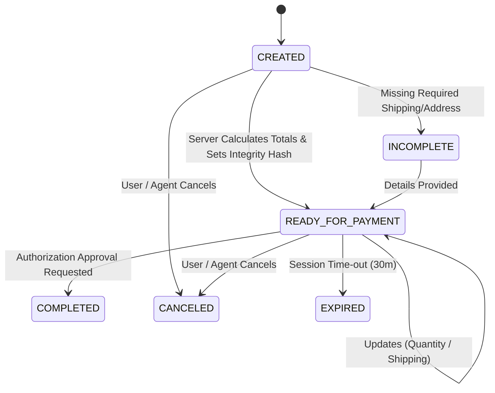

# ACP Checkout API Specification (Agentic Commerce Protocol)

## Protocol Reference
- **Specification:** [Agentic Commerce Protocol (ACP)](https://www.agenticcommerce.dev/docs)
- **Version:** ACP 1.0 (Stateful Merchant Checkout)

## Architectural Principle
> **LLM reasons. Merchant backend controls commerce state.**
> The AI Buyer communicates through strict, sandboxed tool definitions and never directly accesses the database, modifies pricing, overrides stock, or executes payments.

---

## Endpoints

### 1. `POST /checkout_sessions` (or `POST /api/v1/checkout_sessions`)
Creates an authoritative stateful checkout session from an active cart or product items.

#### Headers
- `Content-Type: application/json`
- `Idempotency-Key: <unique-uuid>` *(optional, recommended for mutations)*
- `x-agent-session-id: <session-id>` *(optional)*

#### Request Body
```json
{
  "cart_id": "c928cf69-14a0-4b72-9114-f4e914dfd52e",
  "fulfillment": {
    "selected_shipping_option_id": "std_delivery"
  }
}
```

#### Response (`201 Created`)
```json
{
  "checkout_id": "8fbb143b-28ef-4171-aaee-c10427da98f8",
  "id": "8fbb143b-28ef-4171-aaee-c10427da98f8",
  "cart_id": "c928cf69-14a0-4b72-9114-f4e914dfd52e",
  "merchant_id": "1d23467c-d67b-40fa-aef8-79d8efd5a065",
  "status": "READY_FOR_PAYMENT",
  "currency": "INR",
  "subtotal": 4499,
  "tax": 450,
  "shipping": 0,
  "discount": 0,
  "total": 4949,
  "item_count": 1,
  "items": [
    {
      "id": "d0e14a1e-84fc-4ce0-b466-9e8cbb0a85ce",
      "product_id": "8a22b61b-99b1-4f96-84b8-93a408923d99",
      "product_name": "SoundMax ANC Pro Wireless Headphones",
      "sku": "SND-ANC-001",
      "unit_price": 4499,
      "quantity": 1,
      "total_price": 4499
    }
  ],
  "fulfillment": {
    "selected_shipping_option_id": "std_delivery",
    "shipping_options": [
      {
        "id": "std_delivery",
        "label": "Standard Delivery (2-3 Business Days)",
        "cost": 0,
        "estimated_days": "2-3 business days"
      },
      {
        "id": "exp_delivery",
        "label": "Express Delivery (Next Day Air)",
        "cost": 200,
        "estimated_days": "Next day"
      }
    ]
  },
  "integrity_hash": "e3b0c44298fc1c149afbf4c8996fb92427ae41e4649b934ca495991b7852b855",
  "capabilities": {
    "can_update_quantity": true,
    "can_update_fulfillment": true,
    "can_cancel": true,
    "can_complete": true,
    "payment_methods_supported": ["upi", "card", "netbanking", "wallet"]
  },
  "expires_at": "2026-08-29T21:30:00.000Z",
  "created_at": "2026-08-29T21:00:00.000Z",
  "updated_at": "2026-08-29T21:00:00.000Z"
}
```

---

### 2. `GET /checkout_sessions/:id`
Retrieves the authoritative session details.

---

### 3. `POST /checkout_sessions/:id`
Updates quantity or fulfillment options with server-side inventory re-check and authoritative recalculation.

#### Request Body
```json
{
  "items": [
    {
      "product_id": "8a22b61b-99b1-4f96-84b8-93a408923d99",
      "quantity": 2
    }
  ]
}
```

---

### 4. `POST /checkout_sessions/:id/complete`
Transitions checkout session to `COMPLETED` after verifying the SHA-256 snapshot integrity hash.

---

### 5. `POST /checkout_sessions/:id/cancel`
Cancels an active checkout session.

---

## State Machine



---

## Security & Failure Handling

| Failure Scenario | HTTP Code | Error Code | Behavior |
|---|---|---|---|
| Product Out of Stock | 400 | `PRODUCT_OUT_OF_STOCK` | Rejects checkout creation/update safely |
| Product Unavailable | 400 | `PRODUCT_UNAVAILABLE` | Product inactive or deleted |
| Price Changed | 409 | `PRICE_CHANGED` | Detects catalog change vs cart snapshot, returns previous & current price |
| Invalid State Transition | 400 | `INVALID_STATE_TRANSITION` | Prevents completing/updating canceled or expired sessions |
| Idempotency Replay | 200/201 | N/A | Returns cached response with header `X-Idempotent-Replay: true` |
| Integrity Violation | 400 | `INTEGRITY_VIOLATION` | SHA-256 hash mismatch prevents tampering |
